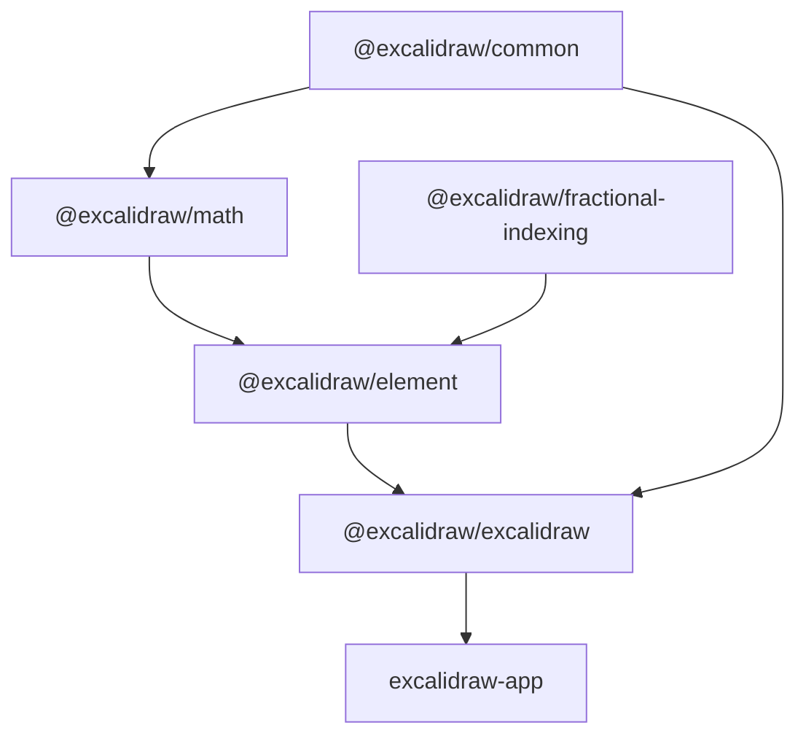

# System Patterns — Excalidraw Monorepo

## 1. Canvas Rendering (3-Canvas Architecture)

The editor uses three overlapping `<canvas>` elements for separation of concerns and performance:

| Canvas | File | Purpose |
| --- | --- | --- |
| **StaticCanvas** | `packages/excalidraw/renderer/staticScene.ts` | Grid, view background, all non-deleted elements |
| **NewElementCanvas** | (inline in `App.tsx`) | Element currently being drawn (re-renders independently) |
| **InteractiveCanvas** | `packages/excalidraw/renderer/interactiveScene.ts` | Selection boxes, transform/resize handles, cursor, collaborator pointers, binding indicators, scrollbars |

- Rendering uses **roughjs** for the distinctive hand-drawn/sketchy appearance
- The `Renderer` class (`packages/excalidraw/scene/Renderer.ts`) uses memoization keyed on `canvasNonce`, zoom, scroll, and selection to avoid redundant work
- `ShapeCache` (`packages/excalidraw/shape.ts`) caches roughjs-generated path geometries

## 2. Element System

- **Base type**: `ExcalidrawElement` with common fields (`id, type, x, y, width, height, angle, strokeColor, backgroundColor, version, isDeleted, ...`)
- **Polymorphic subtypes**: `ExcalidrawTextElement`, `ExcalidrawLinearElement` (line, arrow), freedraw, image, frame, embeddable
- **Factories**: `newElement()`, `newTextElement()`, `newLinearElement()`, `newFreeDrawElement()` in `packages/element/src/newElement.ts`
- **Mutation**: `mutateElement()` in `packages/element/src/mutateElement.ts` — updates element fields, bumps `version` and `versionNonce`
- **Soft delete**: Elements are marked `isDeleted: true` rather than removed, enabling undo and collaboration merge
- **Z-order**: Determined by position in the elements array; `replaceAllElements()` recalculates

## 3. Store / Snapshot / Delta State System

Defined in `packages/element/src/store.ts`:

```text
Store (per App instance)
  ├── snapshot: StoreSnapshot
  │     ├── elements: SceneElementsMap
  │     ├── appState: ObservedAppState
  │     └── metadata (change flags)
  ├── commit() → flushes micro-actions, computes StoreChange + StoreDelta,
  │              emits StoreIncrement (Durable or Ephemeral)
  └── scheduleMicroAction() for fine-grained batching
```

- `StoreDelta` captures fine-grained element and appState changes
- `CaptureUpdateAction`: `IMMEDIATELY` (undoable), `NEVER` (remote/init), `EVENTUALLY` (ephemeral drags)
- The `onChange` callback receives `DurableIncrement` (user actions) or `EphemeralIncrement` (transient)

## 4. Action System

- **ActionManager** (`packages/excalidraw/actions/manager.ts`) — central registry of all user actions
- Each action is an `Action` object with:
  - `perform(elements, appState) → [elements, appState]` — the action logic
  - `keyTest(e) → boolean` — keyboard shortcut matching
  - `PanelComponent` — optional toolbar UI
- Actions directory: `packages/excalidraw/actions/` (~50+ action files: `actionDeleteSelected.ts`, `actionDuplicateSelection.ts`, `actionGroup.ts`, etc.)
- Keyboard shortcuts defined in `packages/excalidraw/keys.ts`
- Actions dispatched from `App` event handlers or `LayerUI`

## 5. AppState

- Central `AppState` interface defined in `packages/excalidraw/types.ts`
- Managed by the `App` class component via `this.setState()`
- Key fields: `activeTool`, `zoom`, `scrollX/scrollY`, `selectedElementIds`, `viewBackgroundColor`, `theme`, `collaborators`, `files`, `isLoading`, `errorMessage`
- Exposed to child components via React Context:
  - `ExcalidrawAppStateContext` (current state)
  - `ExcalidrawSetAppStateContext` (setter)
  - `ExcalidrawElementsContext` (non-deleted elements)
  - `ExcalidrawActionManagerContext` (action registry)
  - `ExcalidrawAPIContext` / `ExcalidrawAPISetContext` (imperative API)

## 6. Dual Jotai Stores

- **Editor store** (`packages/excalidraw/editor-jotai.ts`): Isolated via `jotai-scope`'s `createIsolation()`, prevents atom leakage between multiple editor instances. Manages editor-internal UI state (popups, dialogs, sidebar).
- **App store** (`excalidraw-app/app-jotai.ts`): Standard `createStore()`, shared across the app. Manages collaboration state, online status, share dialog.

## 7. Undo/Redo (Delta-Based History)

`History` class (`packages/excalidraw/history.ts`):

- Stores `HistoryDelta` entries (extend `StoreDelta` with inverse operation)
- On `record()`: creates inverse delta, pushes to `undoStack`, clears `redoStack`
- On undo: applies inverse delta, pushes to `redoStack`
- On redo: applies forward delta, pushes to `undoStack`
- Skips `version`/`versionNonce` fields (always generated fresh on apply)
- Iterates through entries until a `visibleChange` is found

Memory-efficient because it stores deltas, not full snapshots.

## 8. Collaboration Reconciliation

`packages/excalidraw/data/reconcile.ts`:

- `reconcileElements(localElements, remoteElements, appState)` — deterministic conflict resolution
- Rule: local edit wins (same version), `versionNonce` tiebreaker otherwise
- `shouldDiscardRemoteElement()` — rejects stale or out-of-order remote updates
- All data encrypted with AES-GCM before transmission

## 9. Dependency Graph


