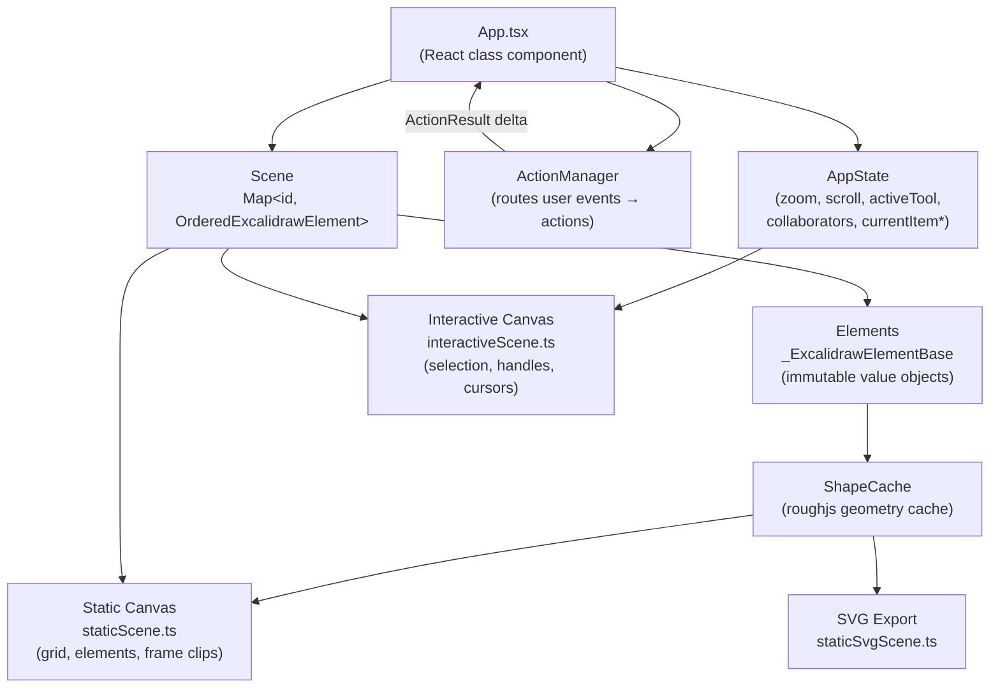

# System Patterns

## Canvas Rendering

Two stacked `<canvas>` elements:

1. **Static canvas** (`packages/excalidraw/renderer/staticScene.ts`) — re-rendered on committed state changes. Draws grid, all scene elements, frame clips.
2. **Interactive canvas** (`packages/excalidraw/renderer/interactiveScene.ts`) — re-rendered on every pointer event. Draws selection boxes, transform handles, snap indicators, collaborator cursors.

SVG export uses a third path (`staticSvgScene.ts`) that serialises the same elements into an SVG DOM node.

## Element System

- All elements share `_ExcalidrawElementBase` (id, x, y, width, height, angle, version, …) defined in `packages/element/src/types.ts`.
- Element type discriminant: `type` field (`"rectangle"`, `"ellipse"`, `"text"`, `"arrow"`, `"freedraw"`, `"image"`, `"frame"`, …).
- Elements are **immutable value objects** — mutations go through `mutateElement()` which increments `version`/`versionNonce`.
- `Scene` holds a `Map<id, OrderedExcalidrawElement>` as the canonical store.
- `ShapeCache` (in `packages/element/src/shape.ts`) caches roughjs geometry keyed by element `seed` to avoid recomputing on each render.

## Action System

`ActionManager` (in `packages/excalidraw/actions/`) routes user events → action handlers. Each action is an object with:
- `name` — unique string key
- `perform(elements, appState, formData, app)` → `ActionResult` (`{ elements?, appState?, commitToHistory? }`)
- Optional `keyBinding`, `contextItemLabel`, `PanelComponent`

Actions never mutate state directly — they return a delta that `App` applies via `setState` / `Scene.replaceAllElements`.

## AppState

Single plain-object managed as React class component state in `App.tsx`. Key sub-objects:
- `activeTool` — current drawing tool + lock state
- `currentItem*` — style properties applied to the next element
- `collaborators` — `Map<SocketId, Collaborator>` for live cursors
- `zoom` / `scrollX` / `scrollY` — viewport transform

History captures diffs between `StoreSnapshot`s via `HistoryDelta` and replays them on undo/redo.