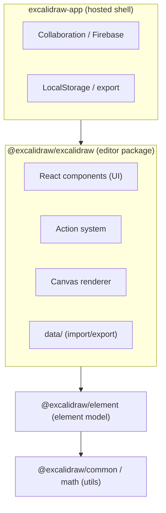
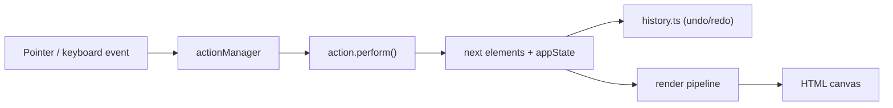
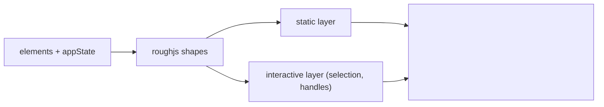
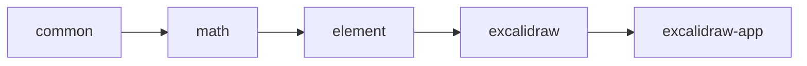

# Excalidraw — Architecture

Reverse-engineered during WS1 onboarding (the repo ships without dev-docs/README).
All statements verified against the source under `packages/` and `excalidraw-app/`.

## 1. High-level Architecture

Excalidraw is a yarn monorepo. The **editor** is a set of publishable packages;
the **app** (`excalidraw-app`) is a thin shell that embeds the editor and adds
collaboration, persistence and PWA concerns.

The editor is consumed by integrators as the `<Excalidraw />` React component
exported from `@excalidraw/excalidraw`.

## 2. Data Flow

A user gesture becomes an action, which produces the next `(elements, appState)`,
which is rendered to canvas.

- Keyboard events are matched via `packages/common/src/keys.ts` (`matchKey`,
  `KEYS`) inside each action's `keyTest()`.
- State transitions are explicit: actions return the new state rather than
  mutating shared globals.

## 3. State Management

- **`appState`** (`packages/excalidraw/appState.ts`) holds editor-wide UI state
  (current tool, zoom, scroll, selection, theme, …).
- **Elements** (the document) are a separate array of `ExcalidrawElement`.
- **Jotai** (`packages/excalidraw/editor-jotai.ts`) provides reactive atoms for
  cross-component state without prop drilling.
- **`history.ts`** records snapshots for undo/redo.

## 4. Rendering Pipeline

- Rendering uses **rough.js** to achieve the hand-drawn look.
- Static content and interactive overlays (selection boxes, resize handles) are
  drawn on separate layers so interaction doesn't force a full re-render.

## 5. Package Dependencies

| Package | Responsibility |
|---|---|
| `@excalidraw/common` | keys, colors, points, constants, generic utils |
| `@excalidraw/math` | geometry primitives |
| `@excalidraw/element` | element model: bounds, collision, binding, Scene, z-order |
| `@excalidraw/excalidraw` | editor: components, actions, data, rendering, fonts |
| `@excalidraw/utils` | misc helpers |
| `@excalidraw/fractional-indexing` | fractional z-index ordering |

Lower layers never import higher ones; this keeps `common`/`element` reusable
and testable in isolation.

## Notes

- Tests: Vitest (globals, jsdom). Unit tests are colocated as `*.test.ts(x)`.
- The main extension point for new user-facing operations is the **action
  system** (`packages/excalidraw/actions/`), combined with key matchers in
  `@excalidraw/common`.
