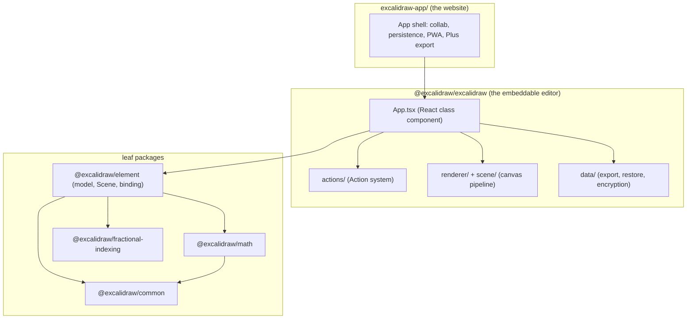
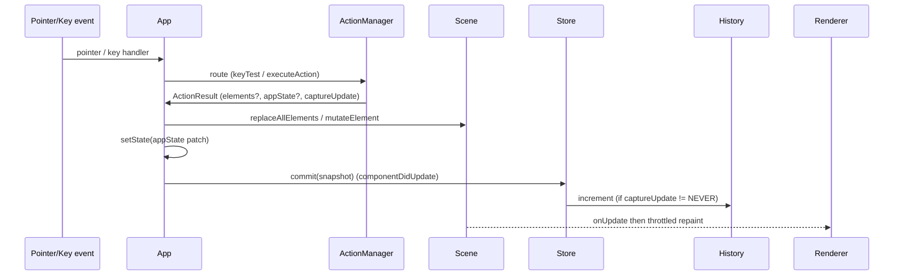

# Excalidraw architecture

> Reconstructed during WS1 from the source. The upstream repo ships a `dev-docs/` site; this snapshot does not, so this file rebuilds the technical picture from the code. Every non-obvious claim cites a `file:line`. Verify against the tree before relying on a line number - the code is the source of truth.

## High-level architecture

Excalidraw is two layers stacked on a chain of utility packages.



The editor (`@excalidraw/excalidraw`) is a self-contained React component with one public entry, `packages/excalidraw/index.tsx:308`. It owns no network or account logic. The website (`excalidraw-app/`) mounts that component and supplies the rest: collaboration, browser persistence, the PWA service worker, and Excalidraw+ export (`excalidraw-app/App.tsx`).

Inside the editor, a single React class component, `App` (`packages/excalidraw/components/App.tsx:620`), is the hub. It holds the UI state, instantiates the long-lived service objects, and wires pointer/keyboard input to the action system and the renderer. The objects it constructs:

| Object | Where | Responsibility |
| --- | --- | --- |
| `Scene` | `App.tsx:634` (class in `packages/element/src/Scene.ts:108`) | owns the element data and its indexes |
| `Store` | `App.tsx:642` (`packages/element/src/store.ts`) | snapshots + change deltas for history/collab |
| `History` | `App.tsx:643` (`packages/excalidraw/history.ts`) | undo / redo stacks |
| `Renderer` | `App.tsx:636` (`packages/excalidraw/scene/Renderer.ts`) | computes renderable elements, drives repaints |
| `ActionManager` | `App.tsx:626` (`packages/excalidraw/actions/manager.tsx`) | registers, routes, and runs actions |

## Data flow

A single user gesture - say, dragging out a rectangle - travels this path:

1. The pointer event hits the canvas handler `handleCanvasPointerDown` (`App.tsx:7687`).
2. Screen coordinates convert to scene coordinates with `viewportCoordsToSceneCoords(event, this.state)` (`App.tsx:7700`), which applies `scrollX` / `scrollY` / `zoom` from `appState`.
3. The active tool decides what to do. For a new shape, a factory from `packages/element/src/newElement.ts` builds the element and it is set as `appState.newElement`; subsequent pointer-move events resize it via `dragNewElement`.
4. The change is committed through `mutateElement` (`packages/element/src/mutateElement.ts:37`) and/or `scene.replaceAllElements()`. Mutation bumps `version` / `versionNonce` / `updated`.
5. `setState` updates `appState`; the scene update fires its `onUpdate` callback.
6. On `componentDidUpdate`, `App` calls `this.store.commit(elementsMap, this.state)` (around `App.tsx:3546`), which diffs the previous snapshot and emits an increment.
7. The increment feeds two consumers: `History` (so the step is undoable, if `captureUpdate` said so) and, in the web app, the collaboration layer (so the delta is broadcast).
8. The renderer repaints the affected canvas layers on the next animation frame.



Actions are the formal version of step 3-4 for discrete commands. `ActionManager` routes a keyboard event or UI click to an action's `perform`, which returns an `ActionResult` (`packages/excalidraw/actions/types.ts:25`). `App.syncActionResult` (`App.tsx:2772`) applies it: `replaceAllElements` for `elements`, `setState` for the `appState` patch, and `store.scheduleAction(captureUpdate)` for history.

## State management

State is split deliberately into two homes:

- Element data lives in `Scene` (`packages/element/src/Scene.ts:108`). The scene keeps the ordered elements array, a map of all elements, a map of non-deleted elements, cached frame subsets, a memoized selected-elements cache, and a `sceneNonce` that invalidates those caches on each update. It is plain TypeScript, decoupled from React.
- UI and view state lives in `appState`, the React state of the `App` class component (type `AppState`, `packages/excalidraw/types.ts:274`; defaults in `packages/excalidraw/appState.ts`). It holds the view transform, selection ids, active tool, in-progress edit fields, style defaults, theme/UI flags, and collaborators.

`appState` points at elements by id; it never owns them. That separation is what lets history, rendering, and collaboration each subscribe to just the slice they need.

Undo/redo is delta-based, not snapshot-cloning. `Store` (`packages/element/src/store.ts`) holds the current snapshot of elements plus appState and emits increments on commit. `History` (`packages/excalidraw/history.ts`) keeps `undoStack` and `redoStack` of those deltas and applies them in reverse. How much an operation records is controlled by its `captureUpdate` value (`CaptureUpdateAction`): `IMMEDIATELY` makes a discrete undo step, `EVENTUALLY` folds into the next one, `NEVER` skips history entirely (used for remote edits and ephemeral UI changes).

## Rendering pipeline

Rendering targets three separate canvases, layered in the DOM (`packages/excalidraw/components/canvases/`):

| Canvas | Renderer entry | Draws |
| --- | --- | --- |
| Static | `renderStaticScene` (`renderer/staticScene.ts:229`) | the committed scene, grid, frames |
| Interactive | `renderInteractiveScene` (`renderer/interactiveScene.ts:1552`) | selection, transform handles, snap lines, remote cursors |
| New element | `renderNewElementScene` (`renderer/renderNewElementScene.ts:16`) | only the element being drawn right now |

The split is a performance decision. The static canvas repaints only when scene content changes and is throttled to an animation frame through `throttleRAF` (`packages/common/src/utils.ts`). The interactive canvas runs a continuous animation loop during interaction (`renderer/animation.ts`) so handles and cursors stay smooth without forcing a full scene redraw on every mouse move.

What gets drawn each frame is decided by `Renderer.getRenderableElements()` (`packages/excalidraw/scene/Renderer.ts`): it filters to elements inside the viewport, drops deleted ones, and excludes the text element currently being edited (that one is handled by a DOM `<textarea>` overlay instead). Each surviving element is drawn by `renderElement` (`packages/element/src/renderElement.ts`), which fetches a cached drawable from `ShapeCache` (`packages/element/src/shape.ts:81`). The cache is a `WeakMap` keyed by element instance; `mutateElement` clears an element's entry when its geometry changes, so the RoughJS shape regenerates only when it has to. RoughJS itself is bound to the static canvas in the `App` constructor (`App.tsx:829`).

## Package dependencies

Internal dependencies (verified from each package's `package.json`) point strictly downward - leaf utilities at the bottom, the editor on top, the web app above all:

```text
excalidraw-app        -> @excalidraw/excalidraw
@excalidraw/excalidraw -> @excalidraw/common, @excalidraw/element, @excalidraw/math
@excalidraw/element    -> @excalidraw/common, @excalidraw/math, @excalidraw/fractional-indexing
@excalidraw/math       -> @excalidraw/common
@excalidraw/common     -> (no internal deps)
@excalidraw/fractional-indexing -> (no internal deps)
@excalidraw/utils      -> (external @excalidraw/laser-pointer only)
```

Two rules fall out of this graph and should be honoured by any change:

- Never import "upward". `packages/element/` must not import from `packages/excalidraw/`, and nothing under `packages/` may import from `excalidraw-app/`. The model layer stays ignorant of the editor; the editor stays ignorant of the website.
- Keep cross-cutting helpers in the lowest package that makes sense. Colours, keys, and geometry already live in `common` and `math`; reuse them rather than duplicating into the editor.

`@excalidraw/excalidraw` also depends on a few published external Excalidraw packages not in this monorepo: `@excalidraw/laser-pointer`, `@excalidraw/mermaid-to-excalidraw`, and `@excalidraw/random-username`.

## Where to look first

| If you are touching... | Start in |
| --- | --- |
| a new shape / element type | `packages/element/src/` (`types.ts`, `newElement.ts`, `renderElement.ts`) |
| a keyboard shortcut | `packages/excalidraw/actions/` + `packages/common/src/keys.ts` |
| a toolbar / panel control | `packages/excalidraw/components/` + an action with a `PanelComponent` |
| an export format | `packages/excalidraw/data/` |
| collaboration | `excalidraw-app/collab/` (`Collab.tsx`, `Portal.tsx`) |
