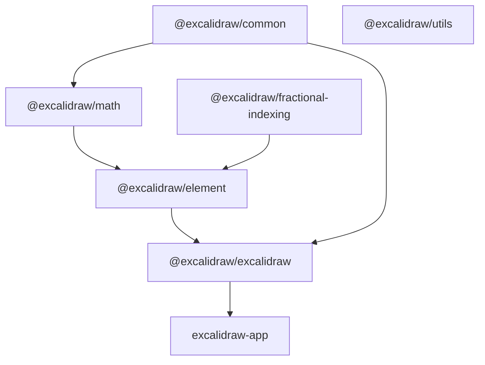
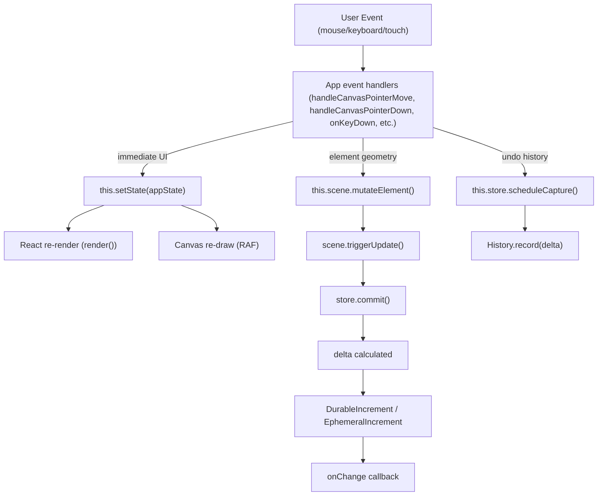
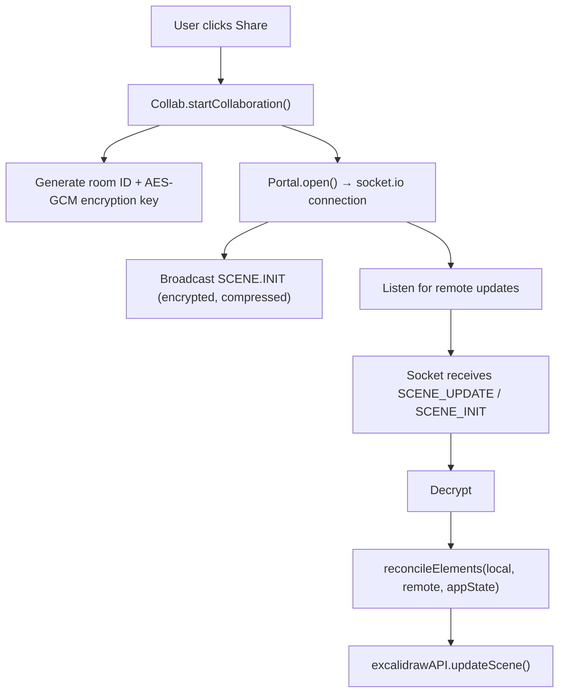
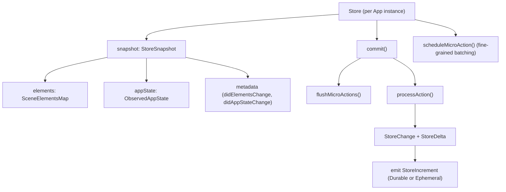
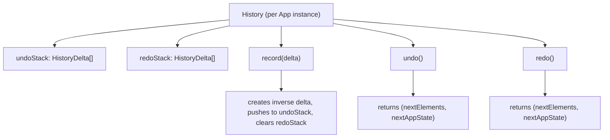
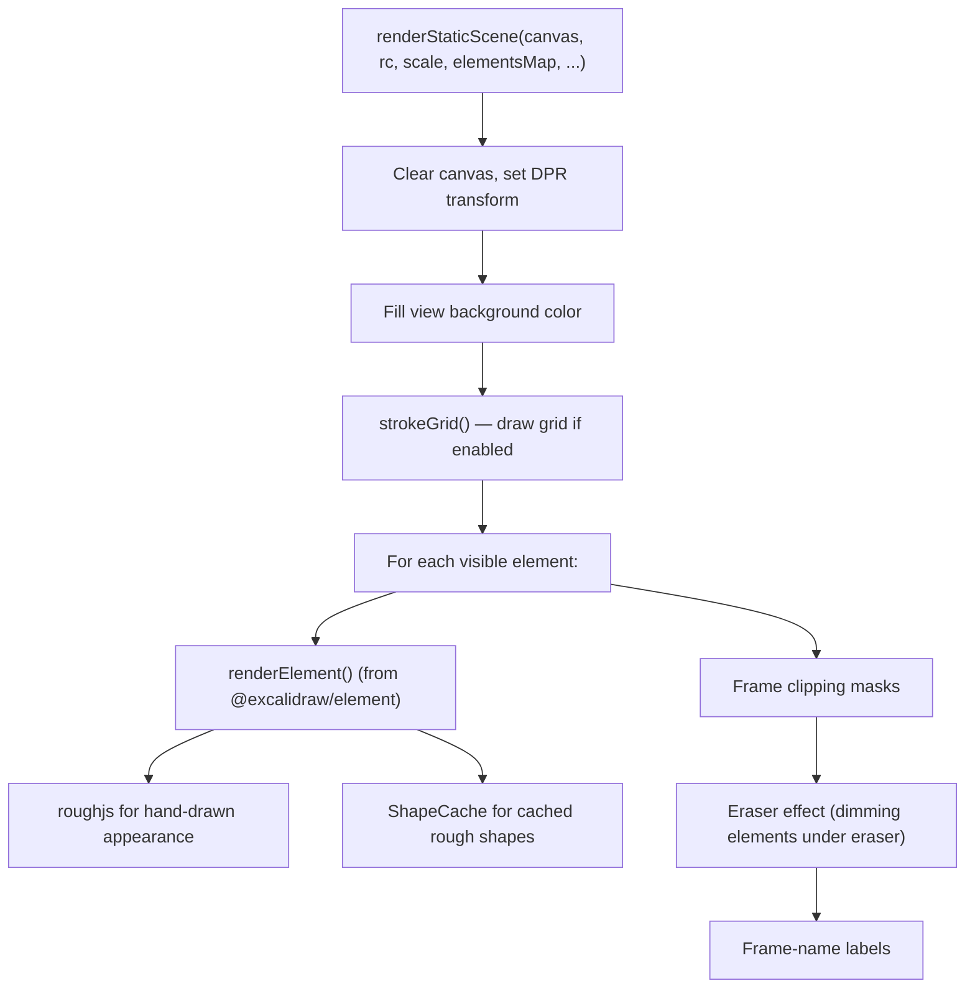
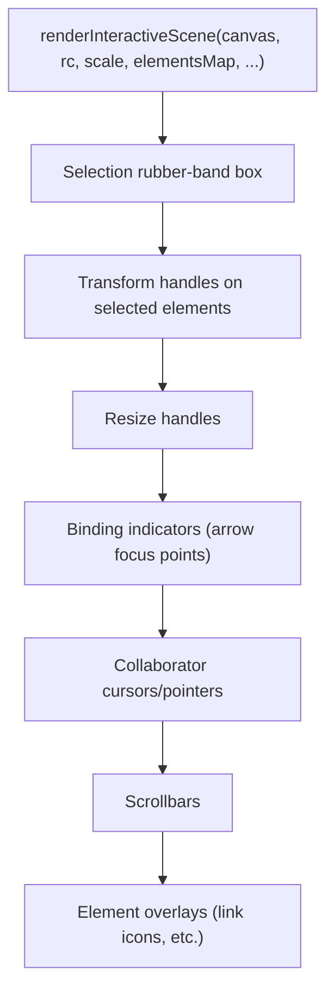

# Technical Architecture — Excalidraw Monorepo

> **See also:** [`docs/memory/activeContext.md`](../memory/activeContext.md) — status of the `fenced-code-blocks-in-text` feature (parser, measurement, rendering)

## 1. High-Level Architecture

### Monorepo Layout

```text
excalidraw-monorepo/
├── excalidraw-app/           # Hosted application (excalidraw.com wrapper)
├── packages/
│   ├── common/               # @excalidraw/common — constants, colors, event system
│   ├── math/                 # @excalidraw/math — geometric primitives & math utils
│   ├── element/              # @excalidraw/element — element types, scene, store, rendering
│   ├── excalidraw/           # @excalidraw/excalidraw — the React editor component (published npm pkg)
│   ├── fractional-indexing/  # @excalidraw/fractional-indexing — ordering strings (forked lib)
│   └── utils/                # @excalidraw/utils — export utilities (canvas, SVG, clipboard)
├── scripts/                  # Build/release tooling
├── public/                   # Static assets (fonts, favicons, screenshots)
├── docs/                     # Documentation
└── firebase-project/         # Firebase cloud functions/config
```

### Package Dependency Graph



Each layer depends only on layers below it, forming a strict directed acyclic graph.

### Entry Points & Component Hierarchy

**Main package entry** (`packages/excalidraw/index.tsx`):

```text
Excalidraw (React.memo wrapper)
  └── ExcalidrawBase
       └── <EditorJotaiProvider>            (isolated Jotai store)
            └── <InitializeApp>             (i18n, theme)
                 └── <App>                  (class component, ~1300 lines)
                      ├── <LayerUI>         (toolbar, menus, dialogs)
                      ├── <StaticCanvas>    (background — grid, non-interactive elements)
                      ├── <NewElementCanvas>(in-progress drawing overlay)
                      ├── <InteractiveCanvas>(foreground — selection, handles, cursors)
                      ├── <SVGLayer>         (laser trails, lasso, eraser)
                      ├── <Hyperlink>        (hyperlink popup)
                      └── <FollowMode>       (collab follow-mode UI)
```

**App entry** (`excalidraw-app/index.tsx`):

```text
ExcalidrawApp
  └── ExcalidrawWrapper
       └── <Excalidraw> (from @excalidraw/excalidraw)
```

### Key Architectural Patterns

| Pattern | Description |
| --- | --- |
| Layered packages | Strict DAG from `common` → `math` → `element` → `excalidraw` → `app` |
| Snapshot-based state | `Store` + `StoreSnapshot` + `StoreDelta` for granular change tracking |
| Dual Jotai stores | Isolated editor store + shared app store |
| Three-canvas rendering | Static, NewElement, Interactive — separate layers for perf |
| Action Manager | All user actions registered as `Action` objects, extensible |
| Delta-based history | Undo/redo stores deltas, not full snapshots (memory efficient) |
| Encrypted communication | AES-GCM for collab and shareable links |
| Reconciliation merge | Deterministic conflict resolution for concurrent edits |

---

## 2. Data Flow

### User Input → State → Rendering Pipeline



### Element Creation Flow

1. **Select tool** — user clicks toolbar → `App.setActiveTool({ type: "rectangle" })`
2. **Pointer down** — `handleCanvasPointerDown()` → creates `this.state.newElement`
3. **Drag** — `handleCanvasPointerMove()` → `dragNewElement()` → updates newElement bounds
4. **Pointer up** — `handleCanvasPointerUp()` → `scene.insertElement()` → commits to Store
5. **History capture** — `Store.commit(CaptureUpdateAction.IMMEDIATELY)` → delta recorded

Key files: `packages/excalidraw/components/App.tsx`, `packages/element/src/newElement.ts`, `packages/element/src/mutateElement.ts`

### Element Modification Flow

1. Select element → drag/resize handle
2. During drag: `Scene.mutateElement()` → `triggerUpdate()` → re-render (ephemeral)
3. On pointer up: `Store.commit(CaptureUpdateAction.IMMEDIATELY)` → durable delta → `History.record()`

### Element Deletion Flow

1. Delete key → `actionDeleteSelected.ts` → `deleteSelectedElements()`
2. Elements marked `isDeleted: true` (soft delete — kept for undo/collab)
3. `scene.replaceAllElements()` → recalculates non-deleted arrays

### Collaboration Data Flow



Key files:

- `excalidraw-app/collab/Collab.tsx` — collaboration lifecycle
- `excalidraw-app/collab/Portal.tsx` — socket.io + encryption
- `packages/excalidraw/data/reconcile.ts` — conflict resolution
- `excalidraw-app/data/index.ts` — SocketUpdateDataSource types

### File Save / Load Flow

**Local auto-save**:

```text
onChange() → LocalData.save(elements, appState, files)
  ├── localStorage: saveDataStateToLocalStorage()
  │     → elements (non-deleted) + appState → JSON
  └── IndexedDB: fileStorage.saveFiles() (via idb-keyval)
        → image files in "files-db" store
```

**Local restore**:

```text
initializeScene() → importFromLocalStorage()
  → restoreElements() (validate, repair bindings, migrate)
  → restoreAppState() (merge with defaults, migrate legacy)
  → excalidrawAPI.updateScene({ elements, appState })
  → loadImages() from IndexedDB
```

**Backend export** (shareable link):

```text
exportToBackend()
  → compressData(serializeAsJSON(elements, appState))
  → compress (pako deflate) + encrypt (AES-GCM)
  → POST to backend → returns id
  → saveFilesToFirebase() → image upload
  → URL = #json={id},{encryptionKey}
```

Key files:

- `packages/excalidraw/data/encode.ts` — compress/encrypt
- `packages/excalidraw/data/restore.ts` — validate, repair, migrate
- `excalidraw-app/data/LocalData.ts` — local persistence
- `excalidraw-app/data/firebase.ts` — backend storage
- `excalidraw-app/data/FileManager.ts` — file upload management

---

## 3. State Management

### Dual Jotai Store Pattern

The project uses two independent Jotai stores with different scoping:

**Editor-internal store** (`packages/excalidraw/editor-jotai.ts`):

- Uses `jotai-scope`'s `createIsolation()` for store isolation
- Prevents atoms leaking between multiple `<Excalidraw>` instances on the same page
- Manages: shape conversion popup, eye dropper, sidebar dock, confirm dialogs

**App-level store** (`excalidraw-app/app-jotai.ts`):

- Standard `createStore()` (shared, not isolated)
- Manages: collaboration API, online status, share dialog, room link, collab errors

### React Context-based State (in `App.tsx`)

The main `App` class component exposes state through React Context:

| Context | Type | Contents |
| --- | --- | --- |
| `ExcalidrawAppStateContext` | `AppState` | Current app state |
| `ExcalidrawSetAppStateContext` | `setState` function | State updater |
| `ExcalidrawElementsContext` | `NonDeletedExcalidrawElement[]` | Visible elements |
| `ExcalidrawActionManagerContext` | `ActionManager` | Action registry |
| `ExcalidrawAPIContext` / `ExcalidrawAPISetContext` | imperative API refs | External API surface |
| `AppContext` / `AppPropsContext` | App instance + props | Direct access |

### Store + Snapshot Delta System (`packages/element/src/store.ts`)



**CaptureUpdateAction** enum controls when an increment is recorded:

- `IMMEDIATELY` — Undoable (most user actions — pointer up, tool change)
- `NEVER` — Not undoable (remote updates, initialization)
- `EVENTUALLY` — Eventually undoable (ephemeral drags, selection changes)

### Undo / Redo (`packages/excalidraw/history.ts`)



Deltas exclude `version` and `versionNonce` (always generated fresh). The system iterates through multiple stacked entries until a `visibleChange` is found.

---

## 4. Rendering Pipeline

### Three-Canvas Architecture

The editor uses three overlapping `<canvas>` elements for separation of concerns:

| Canvas | File | Purpose |
| --- | --- | --- |
| **StaticCanvas** | `renderer/staticScene.ts` | Grid, view background, all non-deleted elements |
| **NewElementCanvas** | (inline in App.tsx) | The element currently being drawn (if any) |
| **InteractiveCanvas** | `renderer/interactiveScene.ts` | Selection boxes, transform handles, resize handles, cursor, collaborator pointers, binding indicators, scrollbars |

This separation means that while dragging a new element, only the NewElementCanvas re-renders — the static canvas stays untouched.

### The Renderer Class (`packages/excalidraw/scene/Renderer.ts`)

```typescript
class Renderer {
  constructor(private scene: Scene) {}

  getRenderableElements(opts): {
    elementsMap; // RenderableElementsMap (Map<string, element>)
    visibleElements; // Only elements in viewport
    newElementCanvasElement; // Element being drawn (if applicable)
    canvasNonce; // Cache invalidation nonce
  };
}
```

The `Renderer` uses `memoize` to cache results based on:

- `canvasNonce` (bumped on scene changes)
- Zoom level
- Scroll position
- Selected element IDs

### Static Scene Rendering (`renderer/staticScene.ts`)



### Interactive Scene Rendering (`renderer/interactiveScene.ts`)



### Element-Level Rendering (`packages/element/src/renderElement.ts`)

- `renderElement()` dispatches by element type (`type` field):

  - rectangle, ellipse, diamond → roughjs polygons
  - line, arrow → `renderLinearElement()`
  - freedraw → `renderFreeDrawElement()` (uses `perfect-freehand`)
  - text → `renderTextElement()` (via Canvas text API + custom font metrics)
  - image → `renderImageElement()` (drawImage with aspect-ratio handling)
  - frame → `renderFrameElement()` (dashed border + label)
  - embeddable → `renderEmbeddableElement()` (placeholder)

- `ShapeCache` (`shape.ts`) caches roughjs-generated shapes keyed by element + renderConfig to avoid recomputation on every frame.

### Fonts (`packages/excalidraw/fonts/`)

- `Fonts` class manages font loading, font-face detection, and custom text metrics
- Font files served as `.woff2` from `public/` (Virgil, Assistant, Cascadia)
- Custom metrics provider via `setCustomTextMetricsProvider()`

---

## 5. Package Dependencies

### Internal Dependency Map

| Package | Version | Depends on |
| --- | --- | --- |
| `@excalidraw/common` | 0.18.0 | _(none except tinycolor2)_ |
| `@excalidraw/math` | 0.18.0 | `@excalidraw/common` |
| `@excalidraw/fractional-indexing` | 1.0.0 | _(standalone)_ |
| `@excalidraw/element` | 0.18.0 | `@excalidraw/common`, `@excalidraw/math`, `@excalidraw/fractional-indexing` |
| `@excalidraw/excalidraw` | 0.18.0 | `@excalidraw/common`, `@excalidraw/element`, `@excalidraw/math` |
| `@excalidraw/utils` | 0.18.0 | _(standalone)_ |
| `excalidraw-app` | 1.0.0 | `@excalidraw/excalidraw`, `@excalidraw/random-username` |

### External Dependencies by Package

#### `@excalidraw/common`

| Package      | Purpose                                 |
| ------------ | --------------------------------------- |
| `tinycolor2` | Color parsing, manipulation, conversion |

#### `@excalidraw/excalidraw` (largest — 25+ deps)

| Package | Purpose |
| --- | --- |
| `roughjs` | Hand-drawn / sketch-style canvas rendering |
| `jotai` + `jotai-scope` | Fine-grained state management with store isolation |
| `pako` | Zlib deflate/inflate compression |
| `nanoid` | Short unique ID generation for elements |
| `clsx` | Conditional CSS class composition |
| `lodash.throttle` / `lodash.debounce` | Rate-limit high-frequency events |
| `browser-fs-access` | File open/save dialogs (native) |
| `pica` / `image-blob-reduce` | Client-side image resizing |
| `perfect-freehand` | Freehand / freedraw stroke generation |
| `png-chunk-text` / `png-chunk-encode` / `png-chunk-extract` | Embed/extract scene data in PNG metadata |
| `codemirror` (x4) | Code editor for AI / diagram conversion |
| `@radix-ui/*` | Accessible UI primitives (popover, dialog, dropdown, etc.) |
| `fuzzy` | Fuzzy search for command palette |
| `sanitize-url` | URL sanitization (security) |
| `canvas-roundrect-polyfill` | `roundRect` polyfill for canvas |
| `sass` | SCSS preprocessing |
| `tunnel-rat` | React portal tunneling for overlays |
| `@excalidraw/laser-pointer` | Laser pointer trail rendering |
| `@excalidraw/mermaid-to-excalidraw` | Mermaid diagram import |
| `@excalidraw/random-username` | Random adjective-noun username pairs |

#### `excalidraw-app`

| Package | Purpose |
| --- | --- |
| `react` / `react-dom` | UI framework (19.x) |
| `firebase` | Authentication, Firestore DB, Cloud Storage |
| `socket.io-client` | Real-time collaboration WebSocket transport |
| `jotai` | App-level state management |
| `i18next-browser-languagedetector` | Browser language auto-detection |
| `idb-keyval` | IndexedDB key-value wrapper (image/file blob storage) |
| `@sentry/browser` | Error monitoring and performance tracking |
| `uqr` | QR code generation for room links |
| `vite-plugin-html` | Build-time HTML template injection |

### Key External Library Roles

| Library | Where | Why |
| --- | --- | --- |
| **roughjs** | `@excalidraw/element` | Generates the sketchy/hand-drawn appearance for all shapes |
| **Jotai** | Both packages | Atomic state management — replaces Redux for granular subscriptions |
| **pako** | `@excalidraw/excalidraw` | Compresses scene JSON before encryption (smaller payloads) |
| **socket.io** | `excalidraw-app` | Real-time bidirectional communication for collaboration |
| **Firebase** | `excalidraw-app` | Backend: auth, Firestore (room metadata), Storage (images/files) |
| **perfect-freehand** | `@excalidraw/excalidraw` | Generates smooth freedraw strokes from pointer points |
| **pica** | `@excalidraw/excalidraw` | High-quality client-side image downscaling for pasted/imported images |
