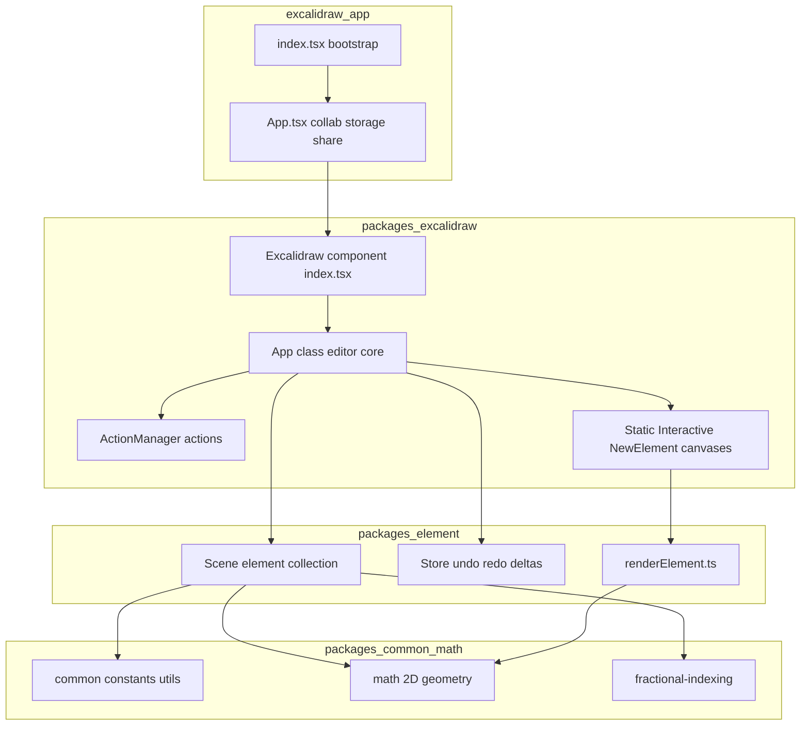
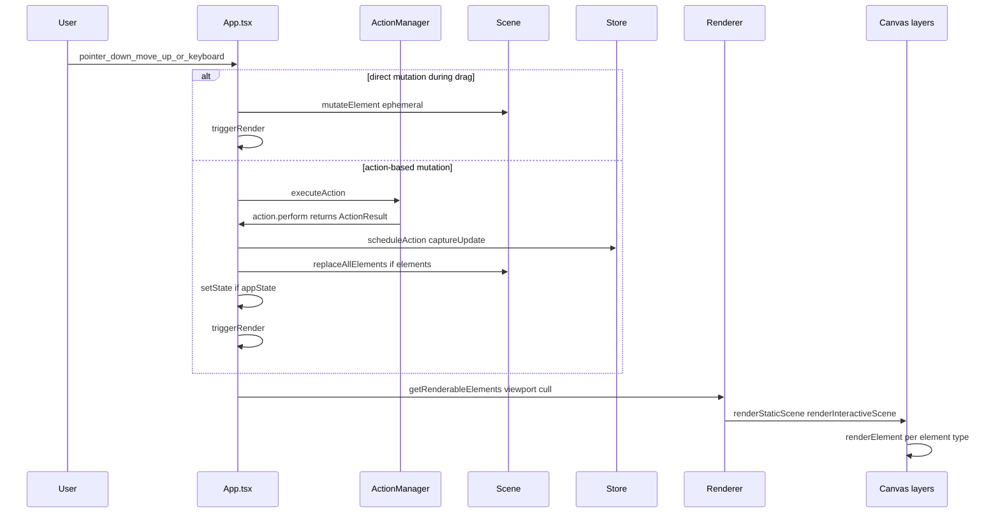
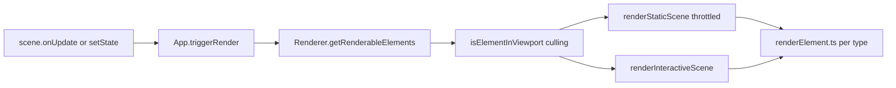
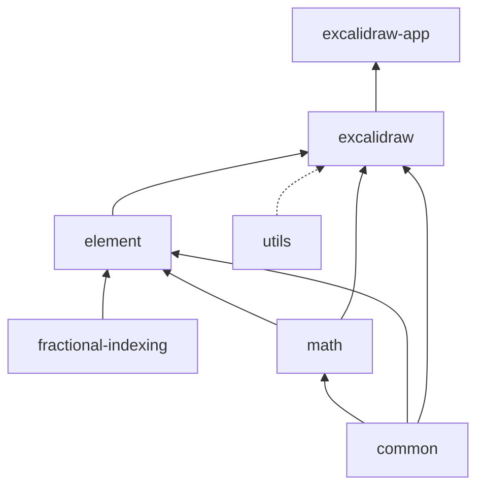

# Architecture

Technical architecture of the Excalidraw monorepo. For onboarding context see the [Memory Bank](../memory/projectbrief.md). Agent rules: [AGENTS.md](../../AGENTS.md).

---

## High-level Architecture

The repository is a **Yarn workspaces monorepo** with a layered package structure. The runnable product (`excalidraw-app`) wraps the embeddable editor library (`@excalidraw/excalidraw`), which in turn depends on lower-level packages for elements, geometry, and shared utilities.



### Separation of Concerns

| Layer | Package | Responsibility |
|-------|---------|----------------|
| Product shell | `excalidraw-app` | Collaboration (Firebase), local persistence, share dialog, PWA, Sentry, language selection |
| Editor library | `@excalidraw/excalidraw` | Embeddable `<Excalidraw />` React component, actions, canvases, history, i18n |
| Element engine | `@excalidraw/element` | Element model, scene graph, undo store, canvas draw primitives |
| Geometry | `@excalidraw/math` | Points, vectors, segments, curves, collision helpers |
| Shared | `@excalidraw/common` | Constants, colors, keyboard keys, utilities, event bus |

**Bootstrap path:** `excalidraw-app/index.tsx` renders `<ExcalidrawApp />` from `excalidraw-app/App.tsx`, which embeds `<Excalidraw />` from `packages/excalidraw/index.tsx`. The `Excalidraw` component wraps the core `App` class (`packages/excalidraw/components/App.tsx`) inside an `EditorJotaiProvider`.

---

## Data Flow

User interactions flow through pointer/keyboard handlers or UI panels, get routed to actions, and produce patches that update Scene, Store, and AppState before triggering a canvas re-render.

### Primary Edit Flow



### Input Sources

| Source | Entry point | Example |
|--------|-------------|---------|
| Pointer | `App.handleCanvasPointerDown/Move/Up` | Draw rectangle, drag selection |
| Keyboard | `ActionManager.handleKeyDown` | Delete, copy, undo (`packages/excalidraw/actions/manager.tsx`) |
| UI panels | `ActionManager.renderAction` → `perform` | Toolbar stroke color, tool switch |
| Imperative API | `ExcalidrawImperativeAPI.updateScene` | Host app programmatic updates |
| Command palette | `executeAction(..., "commandPalette")` | Quick actions |

### Draw-and-Finalize Example

When drawing a shape (e.g. rectangle):

1. **Pointer down** — `App` creates a new element via `packages/element/src/newElement.ts` and stores it in `AppState.newElement`.
2. **Pointer move** — `scene.mutateElement` updates dimensions ephemerally; `triggerRender` redraws the new-element canvas.
3. **Pointer up** — `actionFinalize` (`packages/excalidraw/actions/actionFinalize.tsx`) commits the element, clears `newElement`, returns `ActionResult` with `captureUpdate: IMMEDIATELY`.
4. **Apply** — `syncActionResult` replaces scene elements and schedules undo capture.

### Collaboration Flow (App Layer)

Remote updates arrive in `excalidraw-app/collab/Collab.tsx`, which reconciles elements and calls `api.updateScene()`. This enters the same `syncActionResult` path with `CaptureUpdateAction.NEVER` so remote edits are not pushed to the local undo stack.

### Embed / Host Flow

External consumers use `<Excalidraw onChange={...} />`. After scene or appState updates, `App` fires the `onChange` emitter defined in `packages/excalidraw/index.tsx`, passing elements and appState to the host.

---

## State Management

Editor state is split across three cooperating systems. Jotai is used only for peripheral UI, not for core drawing state.

### Core State Layers

| Layer | Type / Location | Contents |
|-------|-----------------|----------|
| **AppState** | React state on `App` class; defaults from `packages/excalidraw/appState.ts` | Active tool, zoom, scroll offsets, selection, theme, grid, `newElement`, editing flags |
| **Scene** | `packages/element/src/Scene.ts` | Ordered `ExcalidrawElement[]`, element maps, selection hash, `onUpdate` callbacks |
| **Store** | `packages/element/src/store.ts` | Undo/redo history, durable increments, delta emission for collaboration |

### App Construction

In the `App` constructor (`packages/excalidraw/components/App.tsx`):

```typescript
this.actionManager = new ActionManager(this.syncActionResult, ...);
this.scene = new Scene();
this.renderer = new Renderer(this.scene);
this.store = new Store(this);
this.history = new History(this.store);
this.actionManager.registerAll(actions);
```

On mount, `this.scene.onUpdate(this.triggerRender)` connects element changes to rendering.

### Applying Action Results

`syncActionResult` (`App.tsx` ~line 2772) is the single gateway for applying mutations:

1. **`store.scheduleAction(actionResult.captureUpdate)`** — decides undo recording timing.
2. **`scene.replaceAllElements(...)`** — if `actionResult.elements` is set.
3. **`addMissingFiles(...)`** — if `actionResult.files` is set (image elements).
4. **`setState({...actionResult.appState})`** — merges partial appState, respecting controlled props like `viewModeEnabled`.
5. **`scene.triggerUpdate()`** — if only a re-render is needed.

### CaptureUpdateAction

From `packages/element/src/store.ts`:

| Value | When to use |
|-------|-------------|
| `IMMEDIATELY` | Local edits that should appear on the undo stack right away |
| `NEVER` | Remote collaboration updates, scene initialization |
| `EVENTUALLY` | Multi-step operations (e.g. drag in progress) captured when the next `IMMEDIATELY` action fires |

### Jotai (Peripheral Only)

Two isolated Jotai stores prevent cross-contamination:

| Store | File | Scope |
|-------|------|-------|
| Editor | `packages/excalidraw/editor-jotai.ts` | Library UI: color picker, library menu, TTD dialog, sidebar (`jotai-scope` isolation) |
| App | `excalidraw-app/app-jotai.ts` | Product: `isCollaboratingAtom`, `shareDialogStateAtom`, `appLangCodeAtom`, localStorage quota |

Core drawing, selection, and viewport state live in React `AppState` and `Scene`, **not** in Jotai atoms.

---

## Rendering Pipeline

Excalidraw uses **multiple stacked HTML canvases** to separate static content from interactive overlays, improving performance by avoiding full redraws on every pointer move.

### Canvas Layers

| Layer | React component | Renderer module | Draws |
|-------|-----------------|-----------------|-------|
| Static | `components/canvases/StaticCanvas.tsx` | `renderer/staticScene.ts` | Grid, committed elements, frame clips |
| Interactive | `components/canvases/InteractiveCanvas.tsx` | `renderer/interactiveScene.ts` | Selection handles, binding hints, remote cursors, scrollbars |
| New element | `components/canvases/NewElementCanvas.tsx` | `renderer/renderNewElementScene.ts` | In-progress shape being drawn |

### Render Orchestration



Key modules:

- **`packages/excalidraw/scene/Renderer.ts`** — builds a `RenderableElementsMap`, filters off-screen elements via `isElementInViewport`, throttles static scene renders with `renderStaticSceneThrottled`.
- **`packages/excalidraw/renderer/staticScene.ts`** — calls `renderElement` from `@excalidraw/element` for each visible element; draws grid and link icons.
- **`packages/element/src/renderElement.ts`** — per-element-type canvas drawing using Rough.js for hand-drawn strokes, plus specialized paths for text, images, and embeddables.

Canvas `useEffect` hooks in the canvas components call the renderer functions whenever their props (elements, appState, zoom) change.

---

## Package Dependencies

### Dependency Graph



### Package Details

| Package | Depends on | Published as |
|---------|------------|--------------|
| `@excalidraw/fractional-indexing` | — | npm package (vendored) |
| `@excalidraw/common` | `tinycolor2` | `@excalidraw/common` |
| `@excalidraw/math` | `@excalidraw/common` | `@excalidraw/math` |
| `@excalidraw/element` | `common`, `math`, `fractional-indexing` | `@excalidraw/element` |
| `@excalidraw/excalidraw` | `common`, `element`, `math` + UI deps | `@excalidraw/excalidraw` |
| `@excalidraw/utils` | `roughjs`, `pako`, etc. | `@excalidraw/utils` |
| `excalidraw-app` | `@excalidraw/excalidraw` (via Vite alias), React, Firebase, Sentry | private (not published) |

### Build Order

Root `package.json` script `build:packages` runs:

```bash
yarn build:common
  && yarn build:fractional-indexing
  && yarn build:math
  && yarn build:element
  && yarn build:excalidraw
```

Each package emits ESM bundles to its `dist/` directory via `scripts/buildBase.js` or `scripts/buildPackage.js`.

### Dev-Time Linking

`excalidraw-app/vite.config.mts` resolves `@excalidraw/common`, `@excalidraw/element`, `@excalidraw/math`, and `@excalidraw/excalidraw` to their **source** directories under `packages/`, enabling hot reload without rebuilding libraries on every change.

### Key Entry Points

| Entry | File | Exports |
|-------|------|---------|
| App | `excalidraw-app/index.tsx` | Bootstraps React, PWA, Sentry |
| Product | `excalidraw-app/App.tsx` | Collab, storage, menus wrapping `<Excalidraw />` |
| Library | `packages/excalidraw/index.tsx` | `<Excalidraw />`, hooks, data helpers, types |
| Elements | `packages/element/src/index.ts` | Scene, selection, bounds, duplicate, z-index |
| Common | `packages/common/src/index.ts` | Constants, utils, colors, keys |
