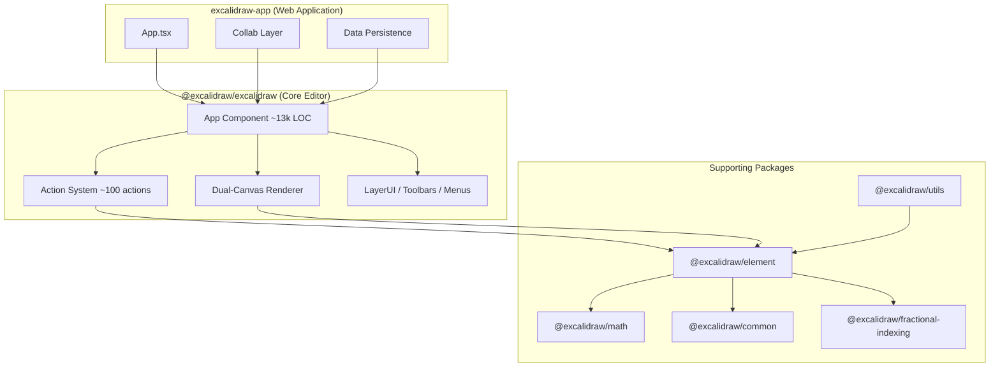
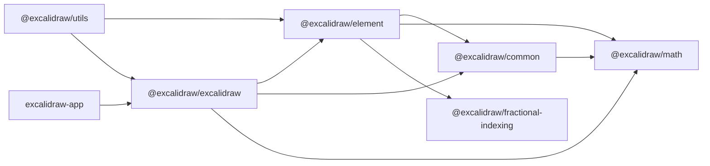
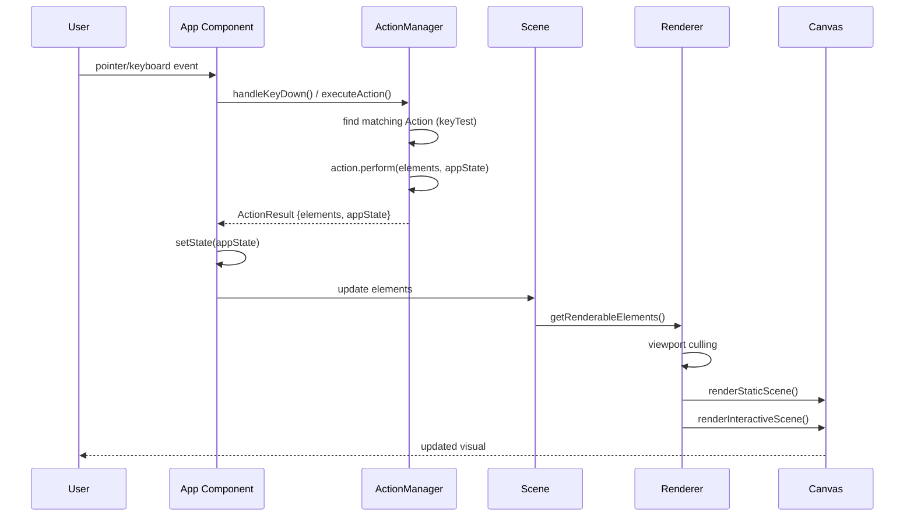
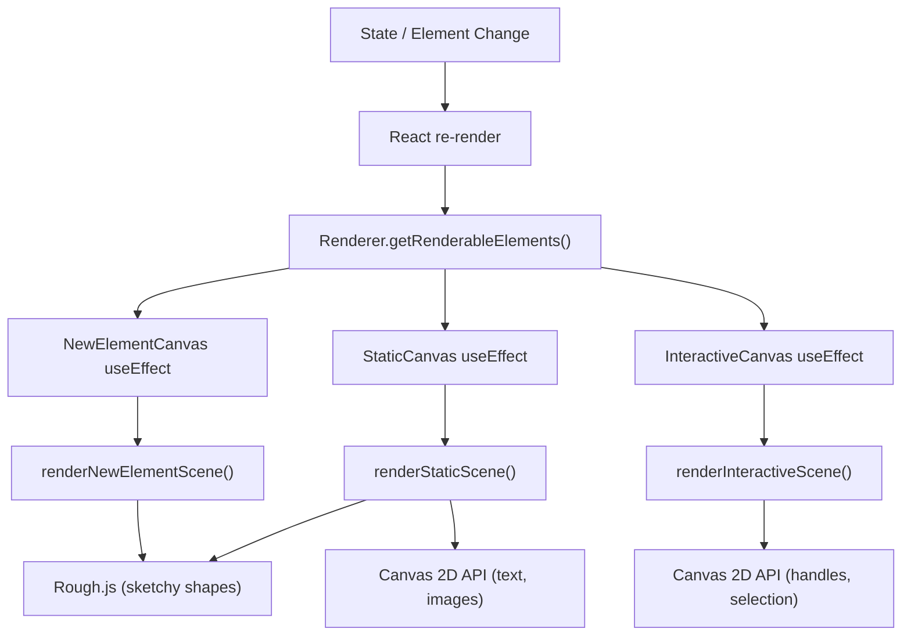
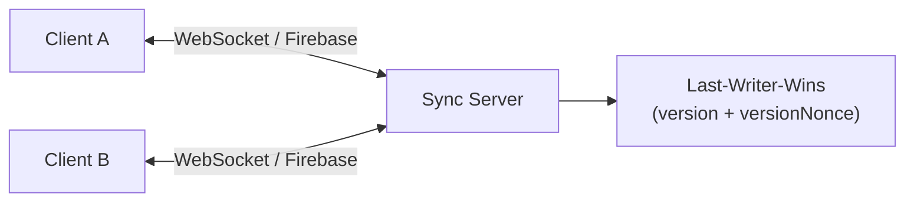

# Excalidraw — Technical Architecture

## High-level Architecture

Excalidraw is a browser-based collaborative drawing editor built as a
TypeScript/React monorepo. The core editor is published as the
`@excalidraw/excalidraw` npm package; the standalone web app
(`excalidraw-app/`) wraps it with collaboration, persistence, and deployment.



## Package Dependencies



| Package | Purpose |
|---------|---------|
| `@excalidraw/math` | 2D geometry: Point, Vector, Line, Curve, Polygon, angle ops |
| `@excalidraw/common` | Constants, colors, event bus, keys, shared utilities |
| `@excalidraw/fractional-indexing` | Conflict-free z-ordering for multiplayer |
| `@excalidraw/element` | Element types, factories, mutation, Scene, Store, bindings |
| `@excalidraw/excalidraw` | Editor component, actions, renderer, UI, hooks |
| `@excalidraw/utils` | Export (PNG/SVG/Canvas), bounding boxes, shape utils |
| `excalidraw-app` | Standalone web app with collaboration, Firebase, Sentry |

## Data Flow



### Event Handling

1. **Pointer events** (`pointerDown`, `pointerMove`, `pointerUp`) are handled
   directly by `App.tsx` — they manage drawing, dragging, resizing, panning.
2. **Keyboard events** are routed through `ActionManager.handleKeyDown()` which
   tests each registered action's `keyTest` predicate.
3. **UI interactions** (toolbar clicks, menu selections) call
   `actionManager.executeAction()` directly.

## State Management

### AppState

Central state object defined in `packages/excalidraw/appState.ts`. Key groups:

| Group | Examples |
|-------|---------|
| Tool | `activeTool`, `currentItemStrokeColor`, `currentItemFontFamily` |
| Viewport | `zoom`, `scrollX`, `scrollY`, `width`, `height` |
| Selection | `selectedElementIds`, `selectedGroupIds`, `hoveredElementIds` |
| UI | `openMenu`, `openDialog`, `openSidebar`, `viewModeEnabled`, `theme` |
| Editing | `editingTextElement`, `newElement`, `resizingElement` |

### State Distribution

`App` (class component) owns the state and distributes it via React contexts:

```
ExcalidrawAppStateContext    → full AppState
ExcalidrawElementsContext    → element array
ExcalidrawActionManagerContext → action manager
ExcalidrawSetAppStateContext → setState function
AppContext                   → App instance
```

Child components consume state via these contexts. A custom
`useAppStateValue()` hook enables selective subscriptions to avoid unnecessary
re-renders.

### Element State

Elements are stored in `Scene` (`packages/element/src/Scene.ts`) as ordered
arrays with O(1) maps:

- `SceneElementsMap` — all elements including deleted, with fractional indices
- `NonDeletedElementsMap` — filtered view without soft-deleted elements
- Lookup by ID is O(1) via `Map<string, ExcalidrawElement>`

## Rendering Pipeline

### Triple-Canvas Architecture

Three `<canvas>` elements are stacked:

| Canvas | Renders | Update Frequency |
|--------|---------|-----------------|
| **StaticCanvas** | Committed elements (shapes, text, images) | Throttled on element changes |
| **NewElementCanvas** | Element currently being drawn (mid-drag) | Every pointer move while drawing |
| **InteractiveCanvas** | Selection handles, hover states, guides | Every frame during interaction |

### Render Cycle



### Performance Optimizations

- **Viewport culling** — only elements intersecting the visible area are drawn
- **Throttled static rendering** — `renderStaticSceneThrottled` prevents
  excessive redraws during rapid changes
- **Shape caching** — generated Rough.js shapes are cached per element version
- **Selective context subscriptions** — `useAppStateValue()` prevents re-renders
  of components that don't depend on changed state

## Element System

### Type Hierarchy

All elements share a base type (`ExcalidrawElementBase`) with common properties:
`id`, `x`, `y`, `width`, `height`, `angle`, `strokeColor`, `backgroundColor`,
`fillStyle`, `opacity`, `version`, `versionNonce`, `isDeleted`, `groupIds`,
`frameId`, `boundElements`, `index`, etc.

Specialized subtypes add type-specific fields:

| Type | Extra Fields |
|------|-------------|
| `text` | `fontSize`, `fontFamily`, `text`, `textAlign`, `containerId` |
| `arrow` | `points`, `startBinding`, `endBinding`, `startArrowhead` |
| `image` | `fileId`, `status`, `scale`, `crop` |
| `frame` | `name` |
| `elbowArrow` | `fixedSegments`, `startIsSpecial`, `endIsSpecial` |

### Mutation Model

Elements are plain data objects (no class instances). Two mutation strategies:

1. **`mutateElement(el, map, updates)`** — in-place mutation that bumps
   `version` and `versionNonce`. Used during collaborative editing where
   identity must be preserved.
2. **`newElementWith(el, updates)`** — returns a new object (shallow copy +
   overrides). Used when immutability is preferred.

### Collaboration Properties

- `version` — incremented on every mutation (reconciliation counter)
- `versionNonce` — random tiebreaker for concurrent edits
- `index` — fractional ordering string for z-order without re-indexing
- `isDeleted` — soft-delete preserves element in history and sync

## Action System

### Action Interface

```typescript
interface Action {
  name: ActionName;
  label?: string;
  keywords?: string[];
  keyTest?: (event: KeyboardEvent) => boolean;
  perform: (elements, appState, formData, app) => ActionResult;
  PanelComponent?: React.FC;  // toolbar/sidebar UI for this action
}
```

### Registration & Dispatch

1. Each action file calls `register(action)` which appends to a global list
2. `ActionManager` imports all registered actions
3. On keyboard event → iterates actions by priority, runs first matching `keyTest`
4. On UI click → `executeAction(action)` directly
5. `perform()` returns `{ elements?, appState?, files?, replaceFiles? }`
6. App merges the result into state

### Action Categories (~70 actions across 34 files)

| Category | Examples |
|----------|---------|
| Element ops | delete, duplicate, select-all, group, ungroup, lock |
| Properties | stroke color, fill, opacity, font, alignment, roundness |
| Canvas | zoom in/out/fit/reset, pan, background color, theme |
| Clipboard | copy, cut, paste, copy as PNG/SVG |
| History | undo, redo |
| Ordering | bring to front, send to back, bring forward, send backward |
| Transform | align left/right/center, distribute, flip horizontal/vertical |
| Export | save to file, export PNG/SVG |
| View | zen mode, grid mode, stats, scroll to content |

## Collaboration Architecture



- **Transport**: Firebase Realtime Database (via `excalidraw-app/collab/`)
- **Encryption**: End-to-end encryption for shared rooms
- **Ordering**: Fractional indexing ensures inserts don't shift existing indices
- **Conflict resolution**: Higher `version` wins; equal versions → lower
  `versionNonce` wins (deterministic tiebreak)
